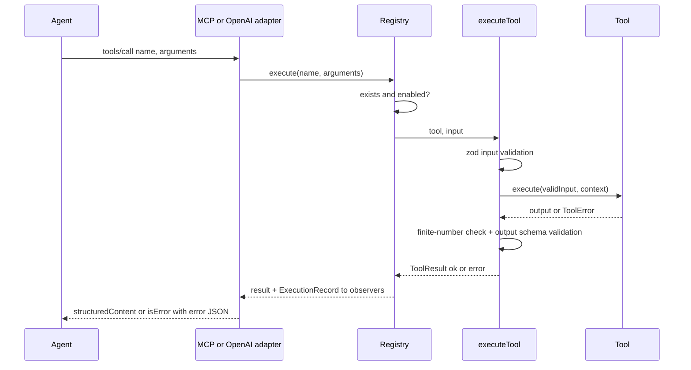

# Architecture

Deterministic Tools is a deterministic computation layer for AI agents. It is split into
independent layers; each layer only depends on the layers below it.

```text
┌──────────────────────────────────────┐
│             AI platforms             │
│ Claude / Cursor / OpenAI / others    │
└──────────────────┬───────────────────┘
                   │ MCP (stdio, Streamable HTTP) / function calling
┌──────────────────▼───────────────────┐
│   Adapters: @rickrosten/agent-deterministic-tools-mcp,      │
│   @rickrosten/agent-deterministic-tools-openai, CLI         │
└──────────────────┬───────────────────┘
┌──────────────────▼───────────────────┐
│    ToolRegistry (@rickrosten/agent-deterministic-tools-core)│
└──────────────────┬───────────────────┘
┌──────────────────▼───────────────────┐
│ Modules: math / finance / statistics │
│ / datetime / units / third-party     │
└──────────────────┬───────────────────┘
┌──────────────────▼───────────────────┐
│ Deterministic core: defineTool,      │
│ validation, ToolError, executeTool   │
└──────────────────────────────────────┘
```

## Packages

| Package | Role | Depends on |
| --- | --- | --- |
| `@rickrosten/agent-deterministic-tools-core` | `Tool`, `Module`, `ToolRegistry`, `executeTool`, errors, JSON Schema export | `zod` |
| `@rickrosten/agent-deterministic-tools-math`, `finance`, `statistics`, `datetime`, `units` | built-in modules | core (+ `decimal.js`) |
| `@rickrosten/agent-deterministic-tools-mcp` | MCP server over stdio and Streamable HTTP | core, `@modelcontextprotocol/sdk` |
| `@rickrosten/agent-deterministic-tools-openai` | OpenAI Chat Completions / Responses / Agents SDK definitions and executor | core |
| `@rickrosten/agent-deterministic-tools` | CLI, configuration, plugin loading, client integrations | all of the above |
| `apps/server` | deployable HTTP server (Docker) | core, modules, mcp |

Rules:

- **Core does not know about MCP.** Nothing in core imports a transport.
- **Adapters are thin.** `mcp` and `openai` translate registry descriptors and results; they
  are independent of each other. A REST or SDK adapter can be added the same way.
- **The registry has no business logic.** It validates modules, namespaces tools, tracks
  enabled state and dispatches to `executeTool`.
- **Modules are independent.** They never import each other and never mutate global state
  (each numeric module uses a private `Decimal.clone()`).

## Tool lifecycle



`executeTool` never throws. Every failure becomes a structured error; unexpected exceptions
become `INTERNAL_ERROR` without stack traces or internal messages.

## Determinism

Tools depend only on their validated input:

- no LLM, network, file system, child processes;
- no clock (`Date.now`) and no randomness (`Math.random`) - enforced by ESLint for module packages;
- no environment variables and no host time zone (datetime uses pure epoch-day arithmetic and
  explicit IANA zones via `Intl`; tests run with `TZ=Pacific/Kiritimati` and re-run under
  several zones);
- `ToolContext` carries only the tool name, a request id and a cancellation signal.

## Precision

| Module | Strategy |
| --- | --- |
| finance | `decimal.js`, 34 significant digits for all intermediate values; final results rounded to `scale` (default 2) with `roundingMode` (default `half_up`); both echoed in the output together with an exact `resultDecimal` string |
| math, statistics, units | `decimal.js` with 40 significant digits, result rounded once to the nearest IEEE-754 double (`0.1 + 0.2 = 0.3`) |
| datetime | integer arithmetic only |

## Error model

| Code | Meaning |
| --- | --- |
| `INVALID_INPUT` | schema or semantic validation failed; `field` names the parameter |
| `INVALID_UNIT` | unknown, ambiguous or incompatible unit |
| `INVALID_DATE` | malformed or impossible date, missing UTC offset |
| `UNSUPPORTED_OPERATION` | mathematically undefined for these inputs (e.g. IRR without sign change) |
| `DIVISION_BY_ZERO` | a divisor is zero |
| `OUT_OF_RANGE` | result or input outside the supported range (overflow, below absolute zero) |
| `PRECISION_ERROR` | requested precision cannot be honoured |
| `TOOL_NOT_FOUND` | unknown or disabled tool |
| `INTERNAL_ERROR` | bug in a tool (output failed its own schema, unexpected exception) |

Shape: `{ "code": "...", "message": "...", "field"?: "...", "details"?: {...} }`.

## Observability

Every execution produces an `ExecutionRecord`: tool, input validation result, output
validation result, duration, success/error code and the top-level input field names. Input
values are only included when `logInputs` is explicitly enabled. The CLI prints records with
`--debug` (and values with `--log-inputs`).

## Versioning

Packages follow semver. The tool API (names, input schemas, output schemas, semantics) is
public API and is frozen in [`api/tools.snapshot.json`](../api/tools.snapshot.json); any
change fails CI until the snapshot is regenerated and reviewed, and must ship with a
changeset of the appropriate bump. See [contributing](contributing.md#versioning).
